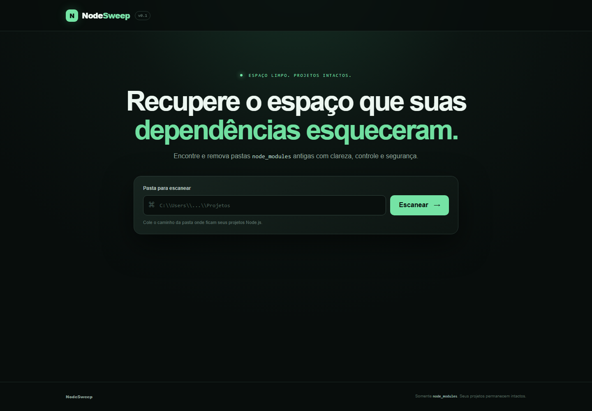

# NodeSweep

> Recupere espaço de projetos Node.js esquecidos sem colocar seu código-fonte em risco.



O NodeSweep encontra projetos abaixo de uma pasta escolhida, mede seus diretórios `node_modules` e permite remover somente os itens selecionados. O foco do v0.1 é deliberadamente estreito: fazer uma única limpeza com uma camada de segurança forte e comportamento previsível.

## Funcionalidades

- varredura iterativa, sem descer em `node_modules`;
- identificação de projetos pela presença de `package.json`;
- tamanho, caminho e última modificação de cada resultado;
- classificação visual por idade: Ativo, Recente ou Antigo;
- seleção individual ou em lote;
- confirmação explícita antes da limpeza;
- cálculo do espaço efetivamente recuperado;
- último caminho salvo localmente no navegador.

## Requisitos

- Windows, macOS ou Linux;
- Node.js 18 ou superior;
- npm 9 ou superior;
- Git, apenas para contribuir.

## Instalação

```powershell
git clone https://github.com/srpedrax/nodesweep.git
cd nodesweep
npm.cmd install
npm.cmd --prefix client install
npm.cmd run build
npm.cmd start
```

Abra `http://localhost:3000`, cole o caminho da pasta onde ficam seus projetos e escolha **Escanear**. No macOS e Linux, use `npm` no lugar de `npm.cmd`.

## Desenvolvimento

Execute em terminais separados:

```powershell
# API em http://localhost:3000
npm.cmd start

# Vite em http://localhost:5173
npm.cmd run dev
```

O servidor do Vite encaminha `/api` para a porta 3000. Para validar o projeto:

```powershell
npm.cmd test
npm.cmd run build
npm.cmd audit --omit=dev
npm.cmd --prefix client audit --omit=dev
```

## Segurança

O NodeSweep v0.1 remove exclusivamente diretórios chamados `node_modules` quando todas as condições abaixo são satisfeitas:

- o diretório existe e é real;
- o pai contém um arquivo `package.json` regular;
- nenhum componente do caminho é symlink ou junction;
- o caminho não corresponde a um alvo de sistema protegido;
- todo o lote foi validado;
- o usuário enviou confirmação explícita;
- o alvo permaneceu igual na revalidação imediatamente anterior à exclusão.

O código-fonte, `.env`, uploads, bancos, arquivos públicos, manifests e lockfiles nunca são alvos válidos. Ainda assim, execute o servidor apenas localmente, mantenha backups e revise a seleção antes de confirmar. Consulte a [política de segurança](SECURITY.md) para reportar vulnerabilidades.

## API

### Escanear projetos

```http
POST /api/scan
Content-Type: application/json
```

```json
{ "rootPath": "C:\\Users\\User\\Documents\\Projetos" }
```

### Limpar projetos selecionados

```http
DELETE /api/cleanup
Content-Type: application/json
```

```json
{
  "paths": ["C:\\Users\\User\\Documents\\Projetos\\app\\node_modules"],
  "confirmed": true
}
```

## Estrutura

```text
client/                 React + Vite + CSS
server/
├── controllers/        adaptação HTTP
├── routes/             endpoints Express
├── services/           scan, tamanho e limpeza
└── utils/              segurança de caminhos e erros
test/                    testes de serviço e integração HTTP
```

## Roadmap

- [x] scanner e limpeza segura de `node_modules`;
- [x] dashboard React responsivo;
- [x] confirmação e seleção em lote;
- [ ] seletor nativo de pastas com aplicação desktop;
- [ ] cancelamento e progresso da varredura;
- [ ] caches e artefatos adicionais por política explícita;
- [ ] pacotes instaláveis e atualizações automáticas.

O escopo atual não inclui cache do npm, `.next`, `dist`, `build` ou outros diretórios.

## Contribuição e licença

Leia [CONTRIBUTING.md](CONTRIBUTING.md) antes de enviar mudanças. O projeto é distribuído sob a [licença MIT](LICENSE).
