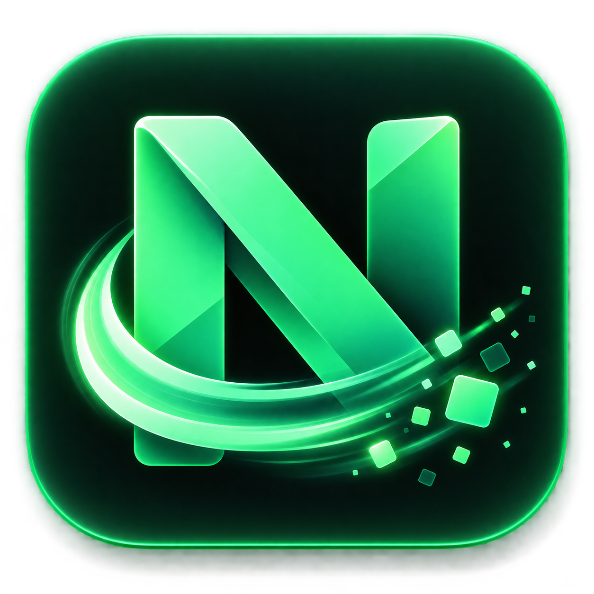

<p align="center">
  
</p>

<h1 align="center">NodeSweep</h1>

> Recupere espaço de projetos Node.js esquecidos sem colocar seu código-fonte em risco.


O NodeSweep é um aplicativo desktop que entende o armazenamento de projetos Node.js e Gradle, explica o que pode ser reconstruído e só remove itens revisados pelo usuário. A linha 2.x usa Tauri 2: sem servidor local e sem exigir Node.js na máquina do usuário final.

## Funcionalidades

- varredura iterativa, sem descer em `node_modules`;
- identificação de projetos pela presença de `package.json`;
- tamanho, caminho e última modificação de cada resultado;
- classificação visual por idade: Ativo, Recente ou Antigo;
- seleção individual ou em lote;
- confirmação explícita antes da limpeza;
- cálculo do espaço efetivamente recuperado;
- último caminho salvo localmente no WebView do aplicativo.
- caches globais e locais do Gradle separados por categoria;
- detecção de projetos Groovy DSL, Kotlin DSL e Wrapper;
- distribuições relacionadas aos projetos conhecidos;
- JDKs provisionados exibidos como protegidos;
- estratégias Conservative, Balanced e Deep Clean;
- limpeza Gradle exclusivamente por IDs emitidos pelo scanner.

## Requisitos

- Windows 10 ou 11 com WebView2, para executar o instalador;
- para desenvolver: Node.js 18+, npm, Rust estável e Microsoft C++ Build Tools.

## Instalação

Baixe o instalador `.exe` da release mais recente, execute-o e abra o NodeSweep pelo menu Iniciar. Nenhum runtime separado é necessário.

Escolha a pasta dos projetos pelo diálogo nativo ou informe o caminho manualmente e selecione **Escanear**.

## Desenvolvimento

```powershell
npm.cmd install
npm.cmd --prefix client install
npm.cmd run dev
```

O Tauri inicia o Vite e abre a janela desktop. Para validar e criar o instalador:

```powershell
npm.cmd test
npm.cmd run build
npm.cmd audit --omit=dev
npm.cmd --prefix client audit --omit=dev
```

### Identidade visual

O arquivo canônico é `assets/branding/nodesweep-icon.png`. Depois de alterá-lo, regenere os ícones do Tauri, instalador e frontend com:

```powershell
npm.cmd run branding
```

Não edite manualmente os derivados em `src-tauri/icons` ou `client/public`.

## Segurança

O NodeSweep remove exclusivamente categorias reconstruíveis reconhecidas quando todas as condições abaixo são satisfeitas:

- o diretório existe e é real;
- o pai contém um arquivo `package.json` regular;
- nenhum componente do caminho é symlink ou junction;
- o caminho não corresponde a um alvo de sistema protegido;
- todo o lote foi validado;
- o usuário enviou confirmação explícita;
- o alvo permaneceu igual na revalidação imediatamente anterior à exclusão.
- itens Gradle são resolvidos por IDs de um snapshot nativo, nunca por caminhos enviados pela interface.

O código-fonte, `.env`, uploads, bancos, arquivos públicos, manifests e lockfiles nunca são alvos válidos. Ainda assim, mantenha backups e revise a seleção antes de confirmar. Consulte a [política de segurança](SECURITY.md) para reportar vulnerabilidades.

## Arquitetura

O React chama os scanners e cleaners por IPC usando IDs opacos de snapshots. Os comandos executam o trabalho de filesystem em threads bloqueantes gerenciadas pelo runtime Tauri. Não há Express, porta HTTP ou acesso genérico do frontend ao filesystem.
O módulo Gradle usa comandos separados (`scan_gradle` e `cleanup_gradle`) e mantém seu registro de alvos apenas em memória.

## Estrutura

```text
client/                 React + Vite + CSS
src-tauri/
├── capabilities/       permissões mínimas do aplicativo
├── icons/              ícones desktop e instalador
└── src/                scanner e limpeza nativos em Rust
```

## Roadmap

- [x] scanner e limpeza segura de `node_modules`;
- [x] dashboard React responsivo;
- [x] aplicativo Tauri com seletor nativo;
- [x] gerenciamento Gradle global e por projeto;
- [x] presets, risk labels e limpeza por snapshot;
- [ ] cancelamento e progresso da varredura;
- [ ] caches e artefatos adicionais por política explícita;
- [ ] pacotes instaláveis e atualizações automáticas.

O escopo atual não inclui cache do npm, `.next`, `dist`, `build` ou outros diretórios.

## Contribuição e licença

Leia [CONTRIBUTING.md](CONTRIBUTING.md) antes de enviar mudanças. O projeto é distribuído sob a [licença MIT](LICENSE).
